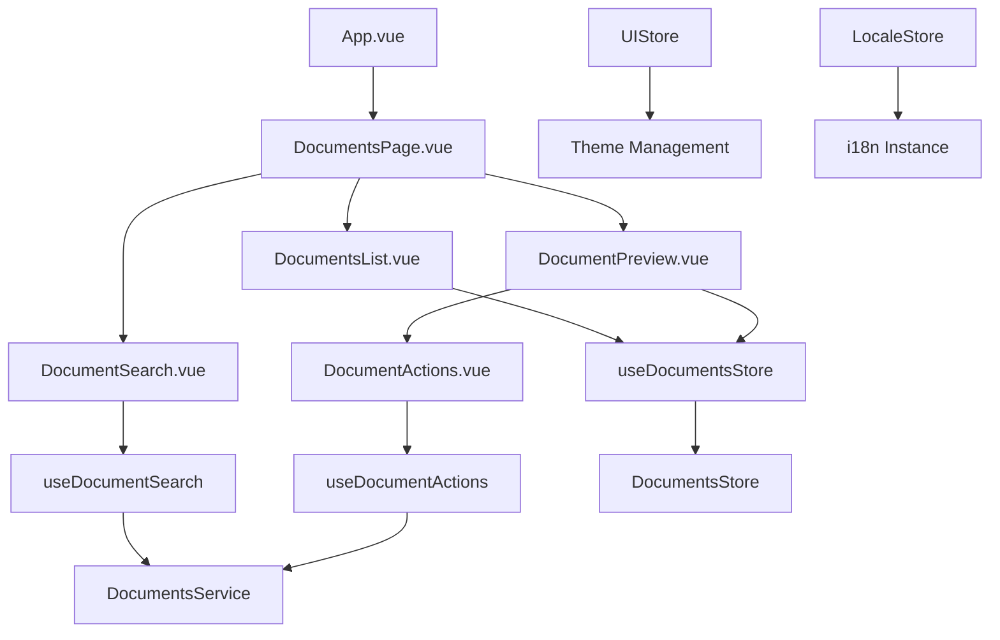
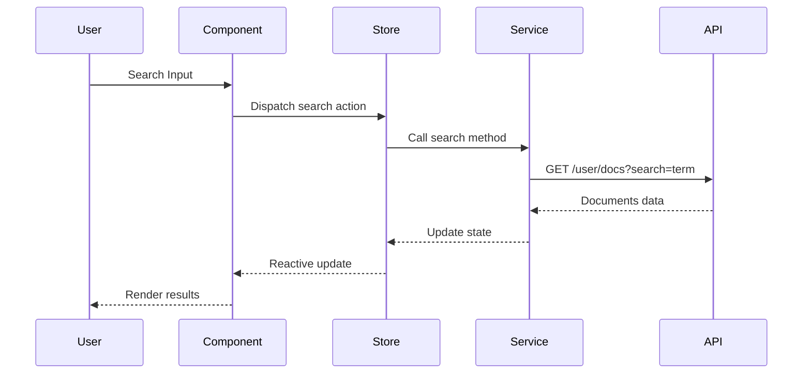
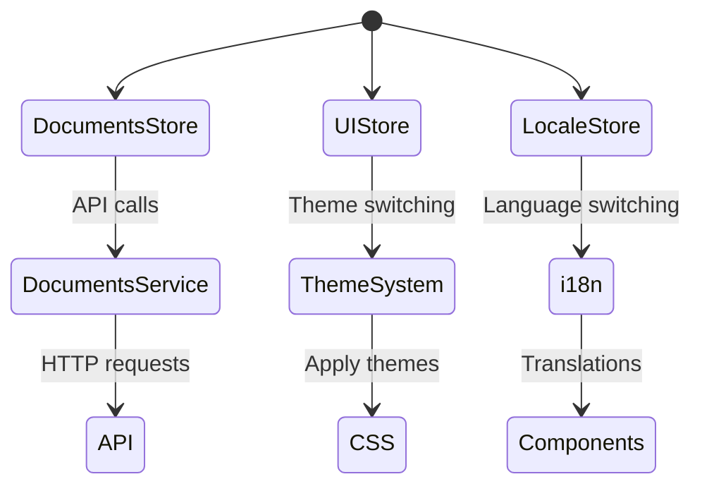
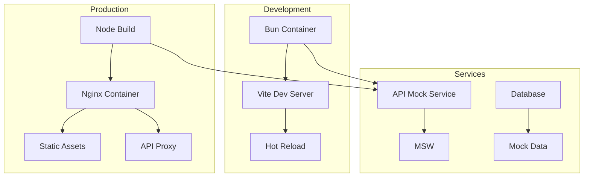

# Архитектура приложения Document Previewer

## Обзор
Этот документ описывает архитектуру веб-приложения для просмотра и управления документами. Приложение построено на Vue 3 с использованием современных подходов к разработке, обеспечивая высокую производительность, поддерживаемость и пользовательский опыт.

## Архитектурные основы

### Структура проекта

```
document-previewer/
├── public/
│   ├── favicon.ico
│   └── fonts/ (Montserrat)
├── src/
│   ├── app/
│   │   ├── config/
│   │   │   ├── i18n.ts
│   │   │   ├── router.ts
│   │   │   └── theme.ts
│   │   ├── main.ts
│   │   └── App.vue
│   ├── features/
│   │   └── documents/
│   │       ├── components/
│   │       │   ├── DocumentSearch.vue
│   │       │   ├── DocumentsList.vue
│   │       │   ├── DocumentPreview.vue
│   │       │   └── DocumentActions.vue
│   │       ├── styles/
│   │       │   ├── DocumentSearch.module.scss
│   │       │   ├── DocumentsList.module.scss
│   │       │   ├── DocumentPreview.module.scss
│   │       │   └── DocumentActions.module.scss
│   │       ├── composables/
│   │       │   ├── useDocumentSearch.ts
│   │       │   └── useDocumentActions.ts
│   │       ├── stores/
│   │       │   └── documentsStore.ts
│   │       ├── types/
│   │       │   └── document.ts
│   │       ├── services/
│   │       │   └── documentsService.ts
│   │       └── index.ts
│   ├── shared/
│   │   ├── components/
│   │   │   ├── Button.vue
│   │   │   ├── Loader.vue
│   │   │   ├── ErrorMessage.vue
│   │   │   ├── LanguageSwitcher.vue
│   │   │   └── GlobalLoader.vue
│   │   ├── styles/
│   │   │   ├── Button.module.scss
│   │   │   ├── Loader.module.scss
│   │   │   ├── ErrorMessage.module.scss
│   │   │   ├── LanguageSwitcher.module.scss
│   │   │   └── GlobalLoader.module.scss
│   │   ├── composables/
│   │   │   ├── useDebounce.ts
│   │   │   └── useApi.ts
│   │   ├── utils/
│   │   │   ├── fileUtils.ts
│   │   │   └── validation.ts
│   │   └── types/
│   │       └── common.ts
│   ├── stores/
│   │   ├── uiStore.ts
│   │   │   └── localeStore.ts
│   ├── locales/
│   │   ├── en.json
│   │   └── ru.json
│   ├── styles/
│   │   ├── variables.scss
│   │   ├── mixins.scss
│   │   ├── global.scss
│   │   └── themes/
│   │       ├── light.scss
│   │       └── dark.scss
│   ├── types/
│   │   └── index.ts
│   ├── utils/
│   │   └── index.ts
│   └── views/
│       └── DocumentsPage.vue
├── tests/
│   ├── unit/
│   │   ├── components/
│   │   ├── composables/
│   │   ├── stores/
│   │   └── utils/
│   ├── integration/
│   │   ├── features/
│   │   └── services/
│   └── e2e/
│       ├── specs/
│       └── utils/
├── .github/
│   └── workflows/
│       ├── ci.yml
│       └── deploy.yml
├── docker/
│   ├── Dockerfile.dev
│   ├── Dockerfile.prod
│   └── docker-compose.yml
├── .env.example
├── package.json
├── vite.config.ts
├── tsconfig.json
├── eslint.config.js
└── README.md
```

### Ключевые архитектурные принципы

1. **Feature-based организация**: Каждый функциональный модуль (`features/documents/`) содержит все необходимые компоненты, логику и стили
2. **Разделение ответственности**: Четкое разделение между бизнес-логикой, UI компонентами и инфраструктурой
3. **Type Safety**: Полная типизация TypeScript на всех уровнях приложения
4. **Component composition**: Переиспользуемые компоненты в `shared/`, feature-specific в `features/`
5. **State management**: Централизованное управление состоянием через Pinia с персистентностью
6. **API layer**: Отдельный сервисный слой для работы с внешними API
7. **Internationalization**: Полная поддержка многоязычности с type-safe переводами
8. **Responsive design**: Mobile-first подход с поддержкой всех устройств
9. **Accessibility**: Соответствие WCAG 2.1 AA стандартам
10. **Performance**: Оптимизация bundle size, lazy loading, code splitting

## Управление состоянием

### Зависимости для персистентности

Для гибкой персистентности состояния используем официальный плагин Pinia `pinia-plugin-persistedstate`, который поддерживает различные storage (localStorage, sessionStorage, custom) и легко интегрируется со stores.

```bash
bun add pinia-plugin-persistedstate
```

**Настройка в main.ts:**

```typescript
import { createApp } from 'vue'
import { createPinia } from 'pinia'
import piniaPluginPersistedstate from 'pinia-plugin-persistedstate'

const app = createApp(App)
const pinia = createPinia()
pinia.use(piniaPluginPersistedstate)

app.use(pinia)
```

## Роль папки views/

Папка `views/` содержит **page-level компоненты** - это страницы приложения, которые:

- **Оркестрируют компоненты**: Собирают вместе компоненты из `features/` и `shared/`
- **Управляют layout**: Определяют общую структуру страницы
- **Работают с роутингом**: Обычно соответствуют маршрутам в Vue Router
- **Не переиспользуются**: В отличие от компонентов, views уникальны для каждой страницы

### DocumentsPage.vue
Главная страница приложения, которая:
- Импортирует компоненты из `features/documents/`
- Управляет общим layout (aside + main)
- Координирует взаимодействие между компонентами
- Обрабатывает глобальные состояния (theme, locale)

```vue
<!-- src/views/DocumentsPage.vue -->
<template>
  <div class="documents-page">
    <aside class="sidebar">
      <DocumentSearch />
      <DocumentsList />
    </aside>
    <main class="content">
      <DocumentPreview v-if="selectedDocument" />
    </main>
  </div>
</template>

### Barrel Exports (index.ts)
Каждая feature имеет файл `index.ts` для централизованного экспорта:

```typescript
// src/features/documents/index.ts
export { default as DocumentSearch } from './components/DocumentSearch.vue'
export { default as DocumentsList } from './components/DocumentsList.vue'
export { default as DocumentPreview } from './components/DocumentPreview.vue'
export { default as DocumentActions } from './components/DocumentActions.vue'

export { useDocumentsStore } from './stores/documentsStore'
export { documentsService } from './services/documentsService'

export type { Document } from './types/document'
```

**Преимущества:**
- Чистые импорты: `import { DocumentSearch, useDocumentsStore } from '@/features/documents'`
- Единая точка входа для feature API
- Легкая рефакторинг - изменения внутренней структуры не влияют на импорты
- Явное определение публичного API фичи

### DocumentsPage.vue
Главная страница приложения, которая:
- Импортирует компоненты из `features/documents/` через barrel exports
- Управляет общим layout (sidebar + content)
- Координирует взаимодействие между компонентами
- Обрабатывает глобальные состояния (theme, locale)

```vue
<!-- src/views/DocumentsPage.vue -->
<template>
  <div class="documents-page">
    <aside class="sidebar">
      <DocumentSearch />
      <DocumentsList />
    </aside>
    <main class="content">
      <DocumentPreview v-if="selectedDocument" />
    </main>
  </div>
</template>

<script setup lang="ts">
import { DocumentSearch, DocumentsList, DocumentPreview, useDocumentsStore } from '@/features/documents'

const documentsStore = useDocumentsStore()
const selectedDocument = computed(() => documentsStore.selectedDocument)
</script>
```
```

## Структура монорепозитория

Для текущего приложения достаточно стандартной структуры single-page приложения. Однако, при масштабировании можно рассмотреть следующие подходы:

**Когда использовать монорепозиторий:**
- Множественные приложения (web + mobile)
- Shared компоненты/утилиты между проектами
- Микросервисная архитектура

**Пример структуры для будущего масштабирования:**

```
monorepo/
├── apps/
│   ├── document-previewer/     # Vue приложение
│   └── admin-panel/           # Будущая админка
├── packages/
│   ├── ui/                    # Shared UI компоненты
│   ├── utils/                 # Shared утилиты
│   ├── config/                # Shared конфигурация
│   └── types/                 # Shared TypeScript типы
├── tools/
│   ├── eslint-config/
│   └── prettier-config/
├── docker/
└── package.json
```

**Инструменты:** Turborepo, Nx, или Rush для управления монорепозиторием.

Для текущего приложения достаточно стандартной структуры single-page приложения.

## CI/CD с GitHub Actions

Для автоматизации процессов разработки и развертывания используем GitHub Actions:

### CI Workflow (ci.yml)
Автоматическая проверка качества кода при каждом push и PR:

```yaml
name: CI

on:
  push:
    branches: [ main, develop ]
  pull_request:
    branches: [ main ]

jobs:
  test:
    runs-on: ubuntu-latest

    steps:
    - uses: actions/checkout@v4

    - name: Setup Bun
      uses: oven-sh/setup-bun@v1
      with:
        bun-version: latest

    - name: Install dependencies
      run: bun install

    - name: Type check
      run: bun run type-check

    - name: Lint
      run: bun run lint

    - name: Format check
      run: bun run format:check

    - name: Run tests
      run: bun run test:ci

    - name: Build
      run: bun run build
```

### Deploy Workflow (deploy.yml)
Автоматическое развертывание при merge в main:

```yaml
name: Deploy

on:
  push:
    branches: [ main ]

jobs:
  deploy:
    runs-on: ubuntu-latest

    steps:
    - uses: actions/checkout@v4

    - name: Setup Bun
      uses: oven-sh/setup-bun@v1

    - name: Install dependencies
      run: bun install

    - name: Build
      run: bun run build

    - name: Deploy to GitHub Pages
      uses: peaceiris/actions-gh-pages@v3
      with:
        github_token: ${{ secrets.GITHUB_TOKEN }}
        publish_dir: ./dist

  docker:
    runs-on: ubuntu-latest

    steps:
    - uses: actions/checkout@v4

    - name: Login to GitHub Container Registry
      uses: docker/login-action@v3
      with:
        registry: ghcr.io
        username: ${{ github.actor }}
        password: ${{ secrets.GITHUB_TOKEN }}

    - name: Build and push Docker image
      uses: docker/build-push-action@v5
      with:
        context: .
        file: ./docker/Dockerfile.prod
        push: true
        tags: ghcr.io/${{ github.repository }}:latest
```

### Docker Workflow (в deploy.yml)
Публикация Docker образов в GitHub Container Registry:

```yaml
- name: Build and push Docker image
  uses: docker/build-push-action@v5
  with:
    context: .
    file: ./docker/Dockerfile.prod
    push: true
    tags: ghcr.io/${{ github.repository }}:latest
```

### Преимущества CI/CD:
- **Автоматическое тестирование** при каждом изменении
- **Проверка качества кода** (lint, format, type-check)
- **Автоматическое развертывание** на GitHub Pages
- **Docker образы** для production deployment
- **Безопасность** - все проверки перед merge

Это обеспечивает надежное развертывание и масштабирование приложения.

## Качество кода и линтинг

### Объединенная конфигурация линтинга
```javascript
// eslint.config.js (объединяет ESLint + Prettier)
import js from '@eslint/js'
import vue from 'eslint-plugin-vue'
import typescript from '@typescript-eslint/eslint-plugin'
import prettier from 'eslint-plugin-prettier'

export default [
  js.configs.recommended,
  ...vue.configs['flat/recommended'],
  {
    files: ['**/*.ts', '**/*.vue', '**/*.js'],
    languageOptions: {
      parser: '@typescript-eslint/parser'
    },
    plugins: {
      '@typescript-eslint': typescript,
      prettier: prettier
    },
    rules: {
      // TypeScript rules
      '@typescript-eslint/no-unused-vars': 'error',
      '@typescript-eslint/explicit-function-return-type': 'warn',

      // Vue rules
      'vue/multi-word-component-names': 'off',
      'vue/component-definition-name-casing': ['error', 'PascalCase'],

      // Code quality
      'no-console': 'warn',
      'prefer-const': 'error',

      // Prettier integration
      'prettier/prettier': [
        'error',
        {
          semi: false,
          singleQuote: true,
          tabWidth: 2,
          trailingComma: 'es5',
          printWidth: 100,
          endOfLine: 'lf',
          vueIndentScriptAndStyle: false
        }
      ]
    }
  }
]
```

### Stylelint (SCSS/CSS)
```javascript
// stylelint.config.js
export default {
  extends: [
    'stylelint-config-standard-scss',
    'stylelint-config-recommended-vue/scss'
  ],
  rules: {
    // CSS Modules
    'selector-class-pattern': null, // Allow CSS Modules hashed classes

    // Custom properties
    'custom-property-pattern': '^--[a-z][a-zA-Z0-9]*(-[a-z][a-zA-Z0-9]*)*$',

    // SCSS
    'scss/dollar-variable-pattern': '^_[a-z][a-zA-Z0-9]*$',
    'scss/percent-placeholder-pattern': '^_[a-z][a-zA-Z0-9]*$',

    // Theme variables
    'property-no-unknown': [
      true,
      {
        ignoreProperties: ['/^--/'] // Allow CSS custom properties
      }
    ]
  }
}
```

### HTML Validation
Используем `html-validate` для проверки HTML в Vue шаблонах:

```javascript
// .htmlvalidate.json
{
  "extends": ["html-validate:recommended"],
  "rules": {
    "no-trailing-whitespace": "error",
    "attribute-boolean-style": "error",
    "element-required-attributes": {
      "img": [
        { "name": "alt", "required": false }
      ]
    }
  }
}
```

### Husky + lint-staged (Pre-commit hooks)
```javascript
// package.json
{
  "husky": {
    "hooks": {
      "pre-commit": "lint-staged"
    }
  },
  "lint-staged": {
    "*.{js,ts,vue}": [
      "eslint --fix",
      "prettier --write"
    ],
    "*.{scss,css}": [
      "stylelint --fix",
      "prettier --write"
    ],
    "*.vue": [
      "html-validate"
    ]
  }
}
```

### Настройка в CI
```yaml
# .github/workflows/ci.yml
- name: Lint
  run: bun run lint

- name: Format check
  run: bun run format:check

- name: Stylelint
  run: bun run stylelint

- name: HTML validate
  run: bun run html-validate
```

### Makefile команды
```makefile
lint: ## Run ESLint
	bun run lint

lint-fix: ## Run ESLint with auto-fix
	bun run lint:fix

stylelint: ## Run Stylelint
	bun run stylelint

stylelint-fix: ## Run Stylelint with auto-fix
	bun run stylelint:fix

format: ## Format code with Prettier
	bun run format

format-check: ## Check code formatting
	bun run format:check

html-validate: ## Validate HTML in Vue templates
	bun run html-validate
```

Это обеспечивает высокое качество кода и предотвращает типичные ошибки разработки.

## Доступность интерфейса (Accessibility)

### Архитектурные принципы доступности

#### 1. Semantic HTML в компонентах
```vue
<!-- DocumentSearch.vue -->
<template>
  <form role="search" @submit.prevent="handleSearch">
    <label for="search-input" class="sr-only">
      {{ t('documents.search.placeholder') }}
    </label>
    <input
      id="search-input"
      ref="searchInput"
      type="search"
      :value="searchQuery"
      :placeholder="t('documents.search.placeholder')"
      :aria-describedby="error ? 'search-error' : undefined"
      :aria-invalid="!!error"
      @input="handleInput"
      @keydown.enter="handleSearch"
    />
    <button type="submit" :disabled="isLoading" :aria-label="t('common.search')">
      <SearchIcon :aria-hidden="true" />
    </button>
    <div v-if="error" id="search-error" role="alert" class="error">
      {{ error }}
    </div>
  </form>
</template>
```

#### 2. Keyboard Navigation
```typescript
// useKeyboardNavigation.ts
import { nextTick } from 'vue'

export function useKeyboardNavigation() {
  const focusFirstItem = async (items: HTMLElement[]) => {
    await nextTick()
    items[0]?.focus()
  }

  const handleArrowKeys = (event: KeyboardEvent, items: HTMLElement[], currentIndex: number) => {
    switch (event.key) {
      case 'ArrowDown':
        event.preventDefault()
        const nextIndex = Math.min(currentIndex + 1, items.length - 1)
        items[nextIndex]?.focus()
        break
      case 'ArrowUp':
        event.preventDefault()
        const prevIndex = Math.max(currentIndex - 1, 0)
        items[prevIndex]?.focus()
        break
    }
  }

  return {
    focusFirstItem,
    handleArrowKeys
  }
}
```

#### 3. Screen Reader Support
```vue
<!-- DocumentsList.vue -->
<template>
  <ul role="listbox" :aria-label="t('documents.list.title')" :aria-activedescendant="activeId">
    <li
      v-for="document in documents"
      :key="document.id"
      :id="`document-${document.id}`"
      role="option"
      :aria-selected="selectedDocument?.id === document.id"
      tabindex="0"
      @click="selectDocument(document)"
      @keydown="handleKeydown"
    >
      <article>
        <h3>{{ document.title }}</h3>
        <p>{{ document.content }}</p>
        <time :datetime="document.createdAt.toISOString()">
          {{ formatDate(document.createdAt) }}
        </time>
      </article>
    </li>
  </ul>
</template>
```

#### 4. Focus Management
```typescript
// useFocusManagement.ts
import { nextTick, ref } from 'vue'

export function useFocusManagement() {
  const focusableElements = ref<HTMLElement[]>([])

  const trapFocus = (container: HTMLElement) => {
    const focusable = container.querySelectorAll(
      'button, [href], input, select, textarea, [tabindex]:not([tabindex="-1"])'
    )
    focusableElements.value = Array.from(focusable) as HTMLElement[]

    const firstElement = focusableElements.value[0]
    const lastElement = focusableElements.value[focusableElements.value.length - 1]

    const handleTabKey = (e: KeyboardEvent) => {
      if (e.key !== 'Tab') return

      if (e.shiftKey) {
        if (document.activeElement === firstElement) {
          lastElement.focus()
          e.preventDefault()
        }
      } else {
        if (document.activeElement === lastElement) {
          firstElement.focus()
          e.preventDefault()
        }
      }
    }

    container.addEventListener('keydown', handleTabKey)

    return () => container.removeEventListener('keydown', handleTabKey)
  }

  return {
    trapFocus,
    focusableElements
  }
}
```

### Инструменты для тестирования доступности

#### ESLint правила
```javascript
// eslint.config.js
{
  plugins: ['jsx-a11y', 'vue-a11y'],
  rules: {
    // Vue accessibility
    'vue-a11y/alt-text': 'error',
    'vue-a11y/anchor-has-content': 'error',
    'vue-a11y/click-events-have-key-events': 'error',
    'vue-a11y/form-control-has-label': 'error',
    'vue-a11y/heading-has-content': 'error',
    'vue-a11y/img-has-alt': 'error',
    'vue-a11y/label-has-for': 'error',
    'vue-a11y/mouse-events-have-key-events': 'error',
    'vue-a11y/no-redundant-roles': 'error',

    // General accessibility
    'jsx-a11y/no-autofocus': 'warn',
    'jsx-a11y/no-onchange': 'error'
  }
}
```

#### Lighthouse CI
```yaml
# .github/workflows/ci.yml
- name: Lighthouse
  run: |
    bunx @lhci/cli autorun
  env:
    LHCI_GITHUB_APP_TOKEN: ${{ secrets.LHCI_GITHUB_APP_TOKEN }}
```

#### Playwright Accessibility Tests
```typescript
// tests/e2e/accessibility.spec.ts
import { test, expect } from '@playwright/test'
import AxeBuilder from '@axe-core/playwright'

test('homepage accessibility', async ({ page }) => {
  await page.goto('/')

  const accessibilityScanResults = await new AxeBuilder({ page })
    .withTags(['wcag2a', 'wcag2aa', 'wcag21a', 'wcag21aa'])
    .analyze()

  expect(accessibilityScanResults.violations).toEqual([])
})
```

### Color Contrast и Themes
```scss
// styles/themes/light.scss
:root {
  --color-text: #1a1a1a;
  --color-background: #ffffff;
  --color-primary: #007bff;
  --color-border: #e0e0e0;

  // High contrast ratios
  --color-text-on-primary: #ffffff;
  --color-error: #d32f2f;
}

// Automatic contrast checking
@function contrast-ratio($color1, $color2) {
  // Implementation of contrast ratio calculation
  @return calc(($color1 + 0.05) / ($color2 + 0.05));
}
```

### WCAG Compliance Checklist

- [ ] **Perceivable**: Alt text, sufficient color contrast (4.5:1+), semantic HTML
- [ ] **Operable**: Keyboard navigation, focus indicators, sufficient time for interactions
- [ ] **Understandable**: Consistent navigation, input assistance, error identification
- [ ] **Robust**: Valid HTML, ARIA support, screen reader compatibility

### Интеграция в CI/CD
```yaml
# .github/workflows/ci.yml
- name: Accessibility Tests
  run: bun run test:accessibility

- name: Lighthouse Accessibility
  run: bunx @lhci/cli autorun --config=.lighthouserc.json
```

Это обеспечивает соответствие стандартам WCAG 2.1 AA и улучшает пользовательский опыт для всех пользователей.

## Адаптивность и кроссбраузерность

### Mobile-First подход

#### CSS Architecture
```scss
// styles/variables.scss
$breakpoints: (
  mobile: 320px,
  tablet: 768px,
  desktop: 1024px,
  wide: 1440px
);

// styles/mixins.scss
@mixin responsive($breakpoint) {
  @media (min-width: map-get($breakpoints, $breakpoint)) {
    @content;
  }
}

// Component styles
.documents-page {
  display: flex;
  flex-direction: column;
  min-height: 100vh;

  @include responsive(tablet) {
    flex-direction: row;
  }

  .sidebar {
    width: 100%;
    padding: 1rem;

    @include responsive(tablet) {
      width: 300px;
      padding: 2rem;
    }

    @include responsive(desktop) {
      width: 350px;
    }
  }

  .content {
    flex: 1;
    padding: 1rem;

    @include responsive(tablet) {
      padding: 2rem;
    }
  }
}
```

#### Touch Interactions
```typescript
// composables/useTouchGestures.ts
import { ref, onMounted, onUnmounted } from 'vue'

export function useTouchGestures() {
  const touchStart = ref<{ x: number; y: number } | null>(null)
  const isSwipe = ref(false)

  const handleTouchStart = (e: TouchEvent) => {
    const touch = e.touches[0]
    touchStart.value = { x: touch.clientX, y: touch.clientY }
  }

  const handleTouchMove = (e: TouchEvent) => {
    if (!touchStart.value) return

    const touch = e.touches[0]
    const deltaX = touch.clientX - touchStart.value.x
    const deltaY = touch.clientY - touchStart.value.y

    // Detect swipe
    if (Math.abs(deltaX) > 50 && Math.abs(deltaY) < 50) {
      isSwipe.value = true
      e.preventDefault() // Prevent scrolling
    }
  }

  const handleTouchEnd = () => {
    if (isSwipe.value) {
      // Handle swipe action (e.g., navigate between documents)
      console.log('Swipe detected')
    }
    touchStart.value = null
    isSwipe.value = false
  }

  return {
    handleTouchStart,
    handleTouchMove,
    handleTouchEnd
  }
}
```

### Responsive Components

#### Document List (Mobile Optimized)
```vue
<!-- DocumentsList.vue -->
<template>
  <div class="documents-list" :class="{ 'mobile-view': isMobile }">
    <!-- Desktop: Grid layout -->
    <div v-if="!isMobile" class="documents-grid">
      <DocumentCard
        v-for="document in documents"
        :key="document.id"
        :document="document"
        @select="selectDocument"
      />
    </div>

    <!-- Mobile: Swipeable cards -->
    <div v-else class="mobile-carousel">
      <DocumentCard
        v-for="document in documents"
        :key="document.id"
        :document="document"
        :style="{ transform: `translateX(${getCardOffset(document)})` }"
        @select="selectDocument"
        @swipe="handleSwipe"
      />
    </div>
  </div>
</template>

<script setup lang="ts">
import { ref, computed, onMounted } from 'vue'

const isMobile = ref(false)

onMounted(() => {
  const checkMobile = () => {
    isMobile.value = window.innerWidth < 768
  }

  checkMobile()
  window.addEventListener('resize', checkMobile)
})
</script>
```

### Cross-Browser Compatibility

#### Browser Support Matrix
```
Chrome: 90+
Firefox: 88+
Safari: 14+
Edge: 90+
iOS Safari: 14+
Android Chrome: 90+
```

#### Polyfills и Fallbacks
```typescript
// utils/polyfills.ts
// Intersection Observer for lazy loading
if (!('IntersectionObserver' in window)) {
  import('intersection-observer')
}

// ResizeObserver for responsive components
if (!('ResizeObserver' in window)) {
  import('resize-observer-polyfill')
}

// CSS Custom Properties fallback
export function supportsCSSCustomProperties() {
  return window.CSS && window.CSS.supports && window.CSS.supports('--test', 'value')
}
```

#### Progressive Enhancement
```vue
<!-- DocumentPreview.vue -->
<template>
  <div class="document-preview">
    <!-- Base functionality -->
    <div class="document-content">
      <h2>{{ document.title }}</h2>
      <p>{{ document.content }}</p>
    </div>

    <!-- Enhanced features (JS enabled) -->
    <div v-if="jsEnabled" class="enhanced-features">
      <button @click="downloadDocument" :disabled="!canDownload">
        {{ t('documents.preview.download') }}
      </button>
      <button v-if="hasImage" @click="deleteDocument">
        {{ t('documents.preview.delete') }}
      </button>
    </div>

    <!-- Fallback for no JS -->
    <noscript>
      <a :href="downloadUrl" class="fallback-download">
        {{ t('documents.preview.download') }}
      </a>
    </noscript>
  </div>
</template>

<script setup lang="ts">
import { ref, onMounted } from 'vue'

const jsEnabled = ref(false)

onMounted(() => {
  jsEnabled.value = true
})
</script>
```

### Testing Cross-Browser Compatibility

#### Playwright Configuration
```typescript
// playwright.config.ts
export default defineConfig({
  projects: [
    { name: 'chromium', use: { browserName: 'chromium' } },
    { name: 'firefox', use: { browserName: 'firefox' } },
    { name: 'webkit', use: { browserName: 'webkit' } },
    {
      name: 'Mobile Safari',
      use: {
        browserName: 'webkit',
        viewport: { width: 375, height: 667 },
        userAgent: 'Mozilla/5.0 (iPhone; CPU iPhone OS 14_0 like Mac OS X)...'
      }
    },
    {
      name: 'Mobile Chrome',
      use: {
        browserName: 'chromium',
        viewport: { width: 360, height: 640 },
        userAgent: 'Mozilla/5.0 (Linux; Android 10; SM-G973F)...'
      }
    }
  ]
})
```

#### BrowserStack Integration
```yaml
# .github/workflows/e2e.yml
- name: BrowserStack Tests
  uses: browserstack/github-actions/setup-local@master
  with:
    local-testing: start
    local-identifier: random

- name: Run E2E Tests
  run: bun run test:e2e
  env:
    BROWSERSTACK_USERNAME: ${{ secrets.BROWSERSTACK_USERNAME }}
    BROWSERSTACK_ACCESS_KEY: ${{ secrets.BROWSERSTACK_ACCESS_KEY }}
```

### Performance Optimization

#### Mobile-Specific Optimizations
```typescript
// composables/useMobileOptimization.ts
import { ref, onMounted } from 'vue'

export function useMobileOptimization() {
  const isSlowConnection = ref(false)
  const prefersReducedMotion = ref(false)

  onMounted(() => {
    // Detect slow connection
    if ('connection' in navigator) {
      const connection = (navigator as any).connection
      isSlowConnection.value = connection.effectiveType === 'slow-2g' ||
                              connection.effectiveType === '2g'
    }

    // Respect user preferences
    prefersReducedMotion.value = window.matchMedia('(prefers-reduced-motion: reduce)').matches
  })

  return {
    isSlowConnection,
    prefersReducedMotion
  }
}
```

#### Critical CSS и Lazy Loading
```vue
<!-- DocumentsPage.vue -->
<template>
  <div class="documents-page">
    <!-- Critical content loads immediately -->
    <DocumentsList />

    <!-- Non-critical content lazy loads -->
    <Suspense>
      <DocumentPreview />
      <template #fallback>
        <div class="preview-skeleton" />
      </template>
    </Suspense>
  </div>
</template>
```

### Mobile UX Patterns

- **Thumb-friendly targets**: 44px+ touch targets
- **Swipe gestures**: Для навигации между документами
- **Pull-to-refresh**: Для обновления списка
- **Offline support**: Service Worker для кэширования
- **Native feel**: iOS/Android-specific interactions

Это обеспечивает отличный пользовательский опыт на всех устройствах и браузерах.

## Производительность и bundle optimization

### Bundle Analysis и Size Tracking

#### Webpack Bundle Analyzer
```typescript
// vite.config.ts
import { defineConfig } from 'vite'
import { visualizer } from 'rollup-plugin-visualizer'

export default defineConfig({
  plugins: [
    visualizer({
      filename: 'dist/bundle-analysis.html',
      open: true,
      gzipSize: true,
      brotliSize: true
    })
  ],
  build: {
    rollupOptions: {
      output: {
        manualChunks: {
          // Vendor chunks
          vue: ['vue'],
          pinia: ['pinia'],
          i18n: ['vue-i18n'],
          router: ['vue-router'],

          // Feature chunks
          documents: ['./src/features/documents'],
          shared: ['./src/shared']
        }
      }
    }
  }
})
```

#### Bundle Size Budgets
```typescript
// vite.config.ts
export default defineConfig({
  build: {
    rollupOptions: {
      output: {
        // Chunk size warnings/errors
        chunkSizeWarningLimit: 1000, // KB
      }
    }
  },

  // Custom size limits
  optimizeDeps: {
    include: ['vue', 'pinia', 'vue-i18n']
  }
})
```

### Performance Metrics и Monitoring

#### Web Vitals Tracking
```typescript
// composables/useWebVitals.ts
import { onMounted } from 'vue'

export function useWebVitals() {
  onMounted(() => {
    // Core Web Vitals
    if ('web-vitals' in window) {
      import('web-vitals').then(({ getCLS, getFID, getFCP, getLCP, getTTFB }) => {
        getCLS(console.log)
        getFID(console.log)
        getFCP(console.log)
        getLCP(console.log)
        getTTFB(console.log)
      })
    }

    // Custom metrics
    const observer = new PerformanceObserver((list) => {
      for (const entry of list.getEntries()) {
        // Track navigation timing
        if (entry.entryType === 'navigation') {
          console.log('Navigation timing:', entry)
        }

        // Track resource loading
        if (entry.entryType === 'resource') {
          console.log('Resource loaded:', entry.name, entry.duration)
        }
      }
    })

    observer.observe({ entryTypes: ['navigation', 'resource'] })
  })
}
```

#### Lighthouse CI Integration
```yaml
# .lighthouserc.json
{
  "ci": {
    "collect": {
      "numberOfRuns": 3,
      "startServerCommand": "bun run preview",
      "startServerReadyPattern": "Local:.{1,5}",
      "url": ["http://localhost:4173"]
    },
    "assert": {
      "assertions": {
        "categories:performance": ["error", {"minScore": 0.9}],
        "categories:accessibility": ["error", {"minScore": 0.9}],
        "categories:best-practices": ["error", {"minScore": 0.9}],
        "categories:seo": ["error", {"minScore": 0.9}],
        "categories:pwa": "off"
      }
    },
    "upload": {
      "target": "temporary-public-storage"
    }
  }
}
```

### Code Splitting и Lazy Loading

#### Route-based Splitting
```typescript
// src/app/router.ts
import { createRouter, createWebHistory } from 'vue-router'

const router = createRouter({
  history: createWebHistory(),
  routes: [
    {
      path: '/',
      name: 'Documents',
      component: () => import('../views/DocumentsPage.vue'),
      // Pre-load critical chunks
      meta: { shouldPreload: true }
    },
    {
      path: '/settings',
      name: 'Settings',
      component: () => import('../views/SettingsPage.vue')
    }
  ]
})

// Pre-loading strategy
router.beforeEach((to, from, next) => {
  if (to.meta.shouldPreload) {
    // Pre-load critical resources
    import('../features/documents')
  }
  next()
})
```

#### Component-based Splitting
```vue
<!-- DocumentsPage.vue -->
<template>
  <div class="documents-page">
    <Suspense>
      <DocumentsList />
      <template #fallback>
        <div class="loading">Loading documents...</div>
      </template>
    </Suspense>

    <Suspense v-if="selectedDocument">
      <DocumentPreview :document="selectedDocument" />
      <template #fallback>
        <div class="loading">Loading preview...</div>
      </template>
    </Suspense>
  </div>
</template>
```

### Compression и Optimization

#### Build Optimizations
```typescript
// vite.config.ts
export default defineConfig({
  build: {
    // Compression
    minify: 'terser',
    terserOptions: {
      compress: {
        drop_console: true,
        drop_debugger: true
      }
    },

    // Source maps for production debugging
    sourcemap: false,

    // CSS code splitting
    cssCodeSplit: true,

    // Asset optimization
    assetsInlineLimit: 4096, // Inline small assets
  },

  // Dependency pre-bundling
  optimizeDeps: {
    include: ['vue', 'vue-router', 'pinia', 'axios']
  }
})
```

### Performance Monitoring в Production

#### Real User Monitoring (RUM)
```typescript
// utils/performance.ts
export function initPerformanceMonitoring() {
  // Error tracking
  window.addEventListener('error', (event) => {
    console.error('Runtime error:', event.error)
    // Send to monitoring service
  })

  // Unhandled promise rejections
  window.addEventListener('unhandledrejection', (event) => {
    console.error('Unhandled promise rejection:', event.reason)
    // Send to monitoring service
  })

  // Performance observer
  if ('PerformanceObserver' in window) {
    const observer = new PerformanceObserver((list) => {
      for (const entry of list.getEntries()) {
        if (entry.entryType === 'largest-contentful-paint') {
          // Track LCP
          console.log('LCP:', entry.startTime)
        }
      }
    })

    observer.observe({ entryTypes: ['largest-contentful-paint'] })
  }
}
```

### CI/CD Performance Gates

```yaml
# .github/workflows/ci.yml
- name: Bundle Analysis
  run: |
    bun run build
    bunx bundle-analyzer dist/assets/*.js

- name: Lighthouse Performance
  run: bunx @lhci/cli autorun

- name: Performance Budget Check
  run: |
    if [ $(stat -f%z dist/assets/*.js | awk '{sum+=$1} END {print sum}') -gt 500000 ]; then
      echo "Bundle size exceeds 500KB limit"
      exit 1
    fi
```

### Performance Targets

| Metric | Target | Tool |
|--------|--------|------|
| **Bundle Size** | < 500KB gzipped | webpack-bundle-analyzer |
| **First Contentful Paint** | < 1.5s | Lighthouse |
| **Largest Contentful Paint** | < 2.5s | Web Vitals |
| **Cumulative Layout Shift** | < 0.1 | Web Vitals |
| **First Input Delay** | < 100ms | Web Vitals |
| **Lighthouse Score** | > 90 | Lighthouse CI |

Это обеспечивает высокую производительность и масштабируемость приложения.


**Настройка в main.ts:**

```typescript
import { createApp } from 'vue'
import { createPinia } from 'pinia'
import piniaPluginPersistedstate from 'pinia-plugin-persistedstate'

const app = createApp(App)
const pinia = createPinia()
pinia.use(piniaPluginPersistedstate)

app.use(pinia)
```

## Архитектура Pinia Stores

### Documents Store
Расположен в `src/features/documents/stores/documentsStore.ts`

```typescript
interface Document {
  id: string
  title: string
  content: string
  imageUrl?: string
  createdAt: Date
}

interface DocumentsState {
  documents: Document[]
  selectedDocument: Document | null
  searchQuery: string
  isLoading: boolean
  error: string | null
}

const useDocumentsStore = defineStore('documents', {
  state: (): DocumentsState => ({
    documents: [],
    selectedDocument: null,
    searchQuery: '',
    isLoading: false,
    error: null
  }),

  getters: {
    hasSelectedDocumentImage: (state) => {
      return state.selectedDocument?.imageUrl != null
    }
  },

  actions: {
    async searchDocuments(query: string) {
      this.isLoading = true
      this.error = null
      try {
        const documents = await documentsService.searchDocuments(query)
        this.documents = documents
        this.searchQuery = query
      } catch (error) {
        this.error = error.message
      } finally {
        this.isLoading = false
      }
    },

    selectDocument(document: Document | null) {
      this.selectedDocument = document
    },

    async deleteDocument(id: string) {
      // Implementation with service call
    }
  },

  persist: {
    paths: ['searchQuery']
  }
})
```

### UI Store
Расположен в `src/stores/uiStore.ts`

```typescript
interface UIState {
  theme: 'light' | 'dark'
  isLoading: boolean
  globalError: string | null
}

const useUIStore = defineStore('ui', {
  state: (): UIState => ({
    theme: 'light',
    isLoading: false,
    globalError: null
  }),

  actions: {
    setTheme(theme: 'light' | 'dark') {
      this.theme = theme
      document.documentElement.setAttribute('data-theme', theme)
    },

    setLoading(loading: boolean) {
      this.isLoading = loading
    },

    setError(error: string | null) {
      this.globalError = error
    }
  },

  persist: {
    paths: ['theme']
  }
})
```

### Locale Store
Расположен в `src/stores/localeStore.ts`

```typescript
interface LocaleState {
  locale: 'ru' | 'en'
}

const useLocaleStore = defineStore('locale', {
  state: (): LocaleState => ({
    locale: 'ru'
  }),

  actions: {
    setLocale(locale: 'ru' | 'en') {
      this.locale = locale
      // Update i18n instance locale
    }
  },

  persist: {
    paths: ['locale']
  }
})
```

### Взаимодействия Stores
- DocumentsStore взаимодействует с DocumentsService для API вызовов и обработки ошибок
- UIStore управляет глобальными состояниями загрузки и переключением тем
- LocaleStore координирует с i18n изменения языка
- Stores используют реактивные обновления для бесшовной интеграции компонентов и синхронизации состояния

## API и сервисы

### Service Layer для API запросов

### Documents Service
Расположен в `src/features/documents/services/documentsService.ts`

```typescript
import { apiClient } from '@/shared/utils/apiClient'

export interface ApiDocument {
  id: string
  title: string
  content: string
  image_url?: string
  created_at: string
}

export interface ApiError {
  message: string
  code: string
}

class DocumentsService {
  async searchDocuments(query: string): Promise<Document[]> {
    try {
      const response = await apiClient.get<ApiDocument[]>('/user/docs', {
        params: { search: query }
      })

      return response.data.map(doc => ({
        id: doc.id,
        title: doc.title,
        content: doc.content,
        imageUrl: doc.image_url,
        createdAt: new Date(doc.created_at)
      }))
    } catch (error) {
      throw this.handleApiError(error)
    }
  }

  async downloadDocument(id: string): Promise<Blob> {
    try {
      const response = await apiClient.get(`/user/docs/${id}/download`, {
        responseType: 'blob'
      })
      return response.data
    } catch (error) {
      throw this.handleApiError(error)
    }
  }

  async deleteDocument(id: string): Promise<void> {
    try {
      await apiClient.delete(`/user/docs/${id}`)
    } catch (error) {
      throw this.handleApiError(error)
    }
  }

  private handleApiError(error: any): Error {
    if (error.response) {
      const apiError: ApiError = error.response.data
      return new Error(apiError.message || 'API Error')
    }
    if (error.request) {
      return new Error('Network Error')
    }
    return new Error('Unknown Error')
  }
}

export const documentsService = new DocumentsService()
```

### API Client
Расположен в `src/shared/utils/apiClient.ts`

```typescript
import axios, { AxiosInstance } from 'axios'

const apiClient: AxiosInstance = axios.create({
  baseURL: import.meta.env.VITE_API_BASE_URL,
  timeout: 10000,
  headers: {
    'Content-Type': 'application/json'
  }
})

// Request interceptor
apiClient.interceptors.request.use(
  (config) => {
    // Add auth headers if needed
    return config
  },
  (error) => Promise.reject(error)
)

// Response interceptor
apiClient.interceptors.response.use(
  (response) => response,
  (error) => {
    // Global error handling
    if (error.response?.status === 401) {
      // Handle unauthorized
    }
    return Promise.reject(error)
  }
)

export { apiClient }
```

## Интернационализация

### Система i18n с поддержкой TypeScript

### Конфигурация
Расположена в `src/app/config/i18n.ts`

```typescript
import { createI18n } from 'vue-i18n'
import en from '@/locales/en.json'
import ru from '@/locales/ru.json'

type MessageSchema = typeof en

const i18n = createI18n<[MessageSchema], 'en' | 'ru'>({
  legacy: false,
  locale: 'ru',
  fallbackLocale: 'en',
  messages: {
    en,
    ru
  }
})

export default i18n
```

### Структура файлов переводов
`src/locales/en.json` и `src/locales/ru.json`

```json
{
  "documents": {
    "search": {
      "placeholder": "Search documents...",
      "noResults": "No documents found"
    },
    "list": {
      "loading": "Loading documents...",
      "error": "Failed to load documents"
    },
    "preview": {
      "download": "Download",
      "delete": "Delete",
      "confirmDelete": "Are you sure you want to delete this document?"
    }
  },
  "common": {
    "cancel": "Cancel",
    "confirm": "Confirm",
    "error": "Error"
  }
}
```

### Type-Safe переводы
Создать `src/types/i18n.ts` для улучшенной безопасности типов:

```typescript
import en from '@/locales/en.json'

type DeepKeys<T> = T extends object
  ? {
      [K in keyof T]: K extends string
        ? T[K] extends object
          ? `${K}.${DeepKeys<T[K]>}`
          : K
        : never
    }[keyof T]
  : never

type TranslationKeys = DeepKeys<typeof en>

declare module 'vue-i18n' {
  export interface DefineLocaleMessage extends typeof en {}
}
```

### Использование в компонентах
```vue
<script setup lang="ts">
import { useI18n } from 'vue-i18n'

const { t } = useI18n()

const handleDelete = () => {
  if (confirm(t('documents.preview.confirmDelete'))) {
    // delete logic
  }
}
</script>

<template>
  <button @click="handleDelete">
    {{ t('documents.preview.delete') }}
  </button>
</template>
```

### Компонент переключателя языка
Расположен в `src/shared/components/LanguageSwitcher.vue`

```vue
<script setup lang="ts">
import { useI18n } from 'vue-i18n'
import { useLocaleStore } from '@/stores/localeStore'
import styles from '../styles/LanguageSwitcher.module.scss'

const { locale } = useI18n()
const localeStore = useLocaleStore()

const switchLanguage = (newLocale: 'ru' | 'en') => {
  localeStore.setLocale(newLocale)
  locale.value = newLocale
}
</script>

<template>
  <select :class="styles.select" :value="locale" @change="switchLanguage($event.target.value)">
    <option value="ru">Русский</option>
    <option value="en">English</option>
  </select>
</template>
```

**LanguageSwitcher.module.scss:**
```scss
.select {
  padding: 8px 12px;
  border: 1px solid var(--color-border);
  border-radius: 4px;
  background: var(--color-background);
  color: var(--color-text);
  font-family: var(--font-family);

  &:focus {
    outline: none;
    border-color: var(--color-primary);
  }
}
```

### Button Component
Расположен в `src/shared/components/Button.vue`

```vue
<script setup lang="ts">
import styles from '../styles/Button.module.scss'

interface Props {
  variant?: 'primary' | 'secondary'
  disabled?: boolean
}

const props = withDefaults(defineProps<Props>(), {
  variant: 'primary'
})
</script>

<template>
  <button
    :class="[styles.button, styles[variant]]"
    :disabled="disabled"
  >
    <slot />
  </button>
</template>
```

**Button.module.scss:**
```scss
.button {
  padding: 8px 16px;
  border: none;
  border-radius: 4px;
  font-family: var(--font-family);
  font-size: 14px;
  cursor: pointer;
  transition: all 0.2s ease;

  &:disabled {
    opacity: 0.6;
    cursor: not-allowed;
  }

  &.primary {
    background: var(--color-primary);
    color: white;

    &:hover:not(:disabled) {
      background: darken(var(--color-primary), 10%);
    }
  }

  &.secondary {
    background: transparent;
    color: var(--color-text);
    border: 1px solid var(--color-border);

    &:hover:not(:disabled) {
      background: var(--color-background-secondary);
    }
  }
}
```

### GlobalLoader Component
Расположен в `src/shared/components/GlobalLoader.vue`

```vue
<script setup lang="ts">
import { useUIStore } from '@/stores/uiStore'
import styles from '../styles/GlobalLoader.module.scss'

const uiStore = useUIStore()
</script>

<template>
  <Teleport to="body">
    <Transition name="fade">
      <div v-if="uiStore.isLoading" :class="styles.overlay">
        <div :class="styles.loader">
          <div :class="styles.spinner"></div>
          <p>{{ $t('common.loading') }}</p>
        </div>
      </div>
    </Transition>
  </Teleport>
</template>
```

**GlobalLoader.module.scss:**
```scss
.overlay {
  position: fixed;
  top: 0;
  left: 0;
  width: 100vw;
  height: 100vh;
  background: rgba(0, 0, 0, 0.5);
  display: flex;
  align-items: center;
  justify-content: center;
  z-index: 9999;
}

.loader {
  background: var(--color-background);
  padding: 2rem;
  border-radius: 8px;
  text-align: center;
  box-shadow: 0 4px 12px rgba(0, 0, 0, 0.3);

  p {
    margin: 1rem 0 0 0;
    color: var(--color-text);
    font-family: var(--font-family);
  }
}

.spinner {
  width: 40px;
  height: 40px;
  border: 4px solid var(--color-border);
  border-top: 4px solid var(--color-primary);
  border-radius: 50%;
  animation: spin 1s linear infinite;
  margin: 0 auto;
}

@keyframes spin {
  0% { transform: rotate(0deg); }
  100% { transform: rotate(360deg); }
}

.fade-enter-active,
.fade-leave-active {
  transition: opacity 0.3s ease;
}

.fade-enter-from,
.fade-leave-to {
  opacity: 0;
}
```

### Интеграция с Stores
LocaleStore координирует изменения языка с экземпляром i18n, обеспечивая реактивные обновления по всему приложению и постоянное состояние локали.

### GlobalLoader в App.vue
GlobalLoader подключается в корневом компоненте для отображения состояния загрузки:

```vue
<!-- src/views/DocumentsPage.vue -->
<template>
  <div class="documents-page">
    <!-- Основной контент -->
  </div>

  <!-- Глобальный прелоадер -->
  <GlobalLoader />
</template>

<script setup lang="ts">
import { GlobalLoader } from '@/shared/components'
</script>
```

**Особенности GlobalLoader:**
- Использует Teleport для рендеринга в body
- Показывается при `uiStore.isLoading = true`
- Блокирует взаимодействие с интерфейсом
- Поддерживает i18n для текста загрузки
- Имеет плавные анимации появления/исчезновения

## Пользовательский интерфейс

### Адаптивность и кроссбраузерность

### Development Dockerfile
Расположен в `docker/Dockerfile.dev`

```dockerfile
FROM oven/bun:1-alpine

WORKDIR /app

# Install dependencies
COPY package.json bun.lockb ./
RUN bun install

# Copy source code
COPY . .

# Expose port
EXPOSE 5173

# Start development server
CMD ["bun", "run", "dev", "--host", "0.0.0.0"]
```

### Production Dockerfile
Расположен в `docker/Dockerfile.prod`

```dockerfile
FROM node:22-alpine

WORKDIR /app

# Copy package files
COPY package.json package-lock.json ./

# Install dependencies
RUN npm ci

# Copy source code
COPY . .

# Build application
RUN npm run build

# Production stage
FROM nginx:alpine

# Copy built assets
COPY --from=0 /app/dist /usr/share/nginx/html

# Simple nginx config for SPA
RUN echo 'server { listen 80; root /usr/share/nginx/html; index index.html; location / { try_files $uri $uri/ /index.html; } }' > /etc/nginx/conf.d/default.conf

# Expose port
EXPOSE 80

# Start nginx
CMD ["nginx", "-g", "daemon off;"]
```

### Docker Compose
Расположен в `docker/docker-compose.yml`

```yaml
version: '3.8'

services:
  app-dev:
    build:
      context: ..
      dockerfile: docker/Dockerfile.dev
    ports:
      - "5173:5173"
    volumes:
      - ..:/app
      - /app/node_modules
    environment:
      - VITE_USE_MOCKS=true

  app-prod:
    build:
      context: ..
      dockerfile: docker/Dockerfile.prod
    ports:
      - "8080:80"
```

### Конфигурация окружения
Создать `.env.example`:

```
VITE_API_BASE_URL=http://localhost:3000/api
VITE_APP_TITLE=Document Previewer
VITE_DEFAULT_LOCALE=ru
VITE_SUPPORTED_LOCALES=ru,en
VITE_USE_MOCKS=true
VITE_USE_MSW=true
```

### Использование
- Development: `docker-compose -f docker/docker-compose.yml up app-dev`
- Production: `docker-compose -f docker/docker-compose.yml up app-prod`

### API Мокирование (основное решение - MSW)

Использовать MSW (Mock Service Worker) для полноценного мокирования API с Service Worker. Это обеспечивает надежное тестирование и разработку без зависимостей от внешних API.

**Настройка MSW для Docker development:**

```typescript
// src/mocks/browser.ts
import { setupWorker } from 'msw'
import { handlers } from './handlers'

export const worker = setupWorker(...handlers)

// Для Docker development с HTTPS
if (import.meta.env.DEV && import.meta.env.VITE_USE_MSW === 'true') {
  worker.start({
    onUnhandledRequest: 'bypass',
    serviceWorker: {
      url: `${window.location.protocol}//${window.location.host}/mockServiceWorker.js`
    }
  })
}
```

**Обработчики** (расположены в `src/mocks/handlers.ts`):

```typescript
import { rest } from 'msw'

export const handlers = [
  rest.get('/user/docs', (req, res, ctx) => {
    const search = req.url.searchParams.get('search')

    // Имитация задержки API
    const mockDocuments = [
      {
        id: '1',
        title: 'Документ 1',
        content: 'Содержимое документа 1',
        image_url: 'https://example.com/image1.jpg',
        created_at: '2024-01-01T00:00:00Z'
      },
      {
        id: '2',
        title: 'Документ 2',
        content: 'Содержимое документа 2',
        created_at: '2024-01-02T00:00:00Z'
      }
    ]

    // Фильтрация по поисковому запросу
    const filtered = search
      ? mockDocuments.filter(doc =>
          doc.title.toLowerCase().includes(search.toLowerCase()) ||
          doc.content.toLowerCase().includes(search.toLowerCase())
        )
      : mockDocuments

    return res(ctx.delay(500), ctx.json(filtered))
  }),

  rest.delete('/user/docs/:id', (req, res, ctx) => {
    return res(ctx.delay(300), ctx.status(204))
  }),

  rest.get('/user/docs/:id/download', (req, res, ctx) => {
    // Mock file download
    return res(
      ctx.delay(1000),
      ctx.set('Content-Type', 'text/plain'),
      ctx.set('Content-Disposition', 'attachment; filename="document.txt"'),
      ctx.body('Mock document content for download')
    )
  })
]
```

**Docker настройка с SSL:**

```dockerfile
# docker/Dockerfile.dev
FROM oven/bun:1-alpine

# Generate self-signed certificate for HTTPS
RUN apk add --no-cache openssl
RUN openssl req -x509 -newkey rsa:4096 -keyout /etc/ssl/private/localhost.key -out /etc/ssl/certs/localhost.crt -days 365 -nodes -subj "/CN=localhost"

WORKDIR /app
COPY package.json bun.lockb ./
RUN bun install
COPY . .

EXPOSE 5173
CMD ["bun", "run", "dev", "--host", "0.0.0.0", "--port", "5173"]
```

**Nginx proxy для HTTPS:**

```nginx
# docker/dev/nginx.conf
server {
    listen 5173 ssl http2;
    server_name localhost;

    ssl_certificate /etc/ssl/certs/localhost.crt;
    ssl_certificate_key /etc/ssl/private/localhost.key;

    location / {
        proxy_pass http://app:5173;
        proxy_set_header Host $host;
        proxy_set_header X-Real-IP $remote_addr;
        proxy_set_header X-Forwarded-Proto $scheme;
    }

    location /mockServiceWorker.js {
        proxy_pass http://app:5173;
    }
}
```

**Docker Compose:**

```yaml
services:
  app-dev:
    build:
      context: ..
      dockerfile: docker/Dockerfile.dev
    volumes:
      - ..:/app
    networks:
      - app-network

  nginx-proxy:
    image: nginx:alpine
    ports:
      - "5173:5173"
    volumes:
      - ./docker/dev/nginx.conf:/etc/nginx/conf.d/default.conf
    depends_on:
      - app-dev
    networks:
      - app-network
```

**Использование:**
- Переменная окружения `VITE_USE_MSW=true` для включения MSW
- Docker development работает через HTTPS с self-signed сертификатом
- Service Worker обрабатывает все API запросы

## Альтернативное API мокирование (fallback - простые mock данные)

Если настройка MSW в Docker окажется слишком сложной, использовать простое решение с mock данными в коде.

Для обеспечения надежной работы можно реализовать полную настройку MSW с решением проблем Docker:

**Настройка MSW для Docker development:**

```typescript
// docker/dev/nginx.conf (для development)
server {
    listen 5173 ssl http2;
    server_name localhost;

    # Self-signed certificate for local development
    ssl_certificate /etc/ssl/certs/localhost.crt;
    ssl_certificate_key /etc/ssl/private/localhost.key;

    location / {
        proxy_pass http://app:5173;
        proxy_set_header Host $host;
        proxy_set_header X-Real-IP $remote_addr;
    }

    # MSW Service Worker
    location /mockServiceWorker.js {
        proxy_pass http://app:5173;
    }
}
```

**Dockerfile.dev с SSL:**

```dockerfile
FROM oven/bun:1-alpine

# Generate self-signed certificate
RUN apk add --no-cache openssl
RUN openssl req -x509 -newkey rsa:4096 -keyout /etc/ssl/private/localhost.key -out /etc/ssl/certs/localhost.crt -days 365 -nodes -subj "/CN=localhost"

WORKDIR /app
COPY package.json bun.lockb ./
RUN bun install
COPY . .

EXPOSE 5173 443
CMD ["bun", "run", "dev", "--host", "0.0.0.0", "--port", "5173"]
```

**MSW конфигурация для HTTPS:**

```typescript
// src/mocks/browser.ts
import { setupWorker } from 'msw'
import { handlers } from './handlers'

export const worker = setupWorker(...handlers)

// Для Docker development с HTTPS
if (import.meta.env.DEV && import.meta.env.VITE_USE_MSW === 'true') {
  worker.start({
    onUnhandledRequest: 'bypass',
    serviceWorker: {
      url: `${window.location.protocol}//${window.location.host}/mockServiceWorker.js`
    }
  })
}
```

**docker-compose.yml с nginx proxy:**

```yaml
services:
  app-dev:
    build:
      context: ..
      dockerfile: docker/docker/Dockerfile.dev
    volumes:
      - ..:/app
    networks:
      - app-network

  nginx-proxy:
    image: nginx:alpine
    ports:
      - "5173:5173"
      - "443:443"
    volumes:
      - ./docker/dev/nginx.conf:/etc/nginx/conf.d/default.conf
      - ./docker/ssl:/etc/ssl
    depends_on:
      - app-dev
    networks:
      - app-network
```

**Это обеспечивает:**
- Надежную настройку локального development окружения
- Правильную работу Service Worker в контейнеризованной среде
- Безопасное мокирование API для разработки

## Makefile для основных команд

Создать `Makefile` в корне проекта для автоматизации основных задач:

```makefile
.PHONY: help install dev build test lint format docker-dev docker-prod clean

# Default target
help: ## Show this help message
	@echo 'Usage: make [target]'
	@echo ''
	@echo 'Targets:'
	@awk 'BEGIN {FS = ":.*?## "} /^[a-zA-Z_-]+:.*?## / {printf "  %-15s %s\n", $$1, $$2}' $(MAKEFILE_LIST)

install: ## Install dependencies
	bun install

dev: ## Start development server
	bun run dev

build: ## Build for production
	bun run build

test: ## Run tests
	bun run test

test-watch: ## Run tests in watch mode
	bun run test:watch

lint: ## Run ESLint
	bun run lint

lint-fix: ## Run ESLint with auto-fix
	bun run lint:fix

format: ## Format code with Prettier
	bun run format

type-check: ## Run TypeScript type checking
	bun run type-check

docker-dev: ## Start development environment with Docker
	docker-compose -f docker/docker-compose.yml up app-dev

docker-prod: ## Start production environment with Docker
	docker-compose -f docker/docker-compose.yml up app-prod

docker-build-dev: ## Build development Docker image
	docker-compose -f docker/docker-compose.yml build app-dev

docker-build-prod: ## Build production Docker image
	docker-compose -f docker/docker-compose.yml build app-prod

clean: ## Clean build artifacts and dependencies
	rm -rf dist node_modules/.vite .nuxt

setup: ## Initial project setup
	make install
	make docker-build-dev
	cp .env.example .env
	@echo "Project setup complete. Run 'make dev' to start development server."
```

## Архитектурные диаграммы

### Архитектура компонентов


### Архитектура потока данных


### Архитектура управления состоянием


### Docker архитектура


## План реализации

### Общий бюджет: 24 рабочих часа

Проект разбит на 5 итераций с фокусом на быструю доставку работающего MVP и постепенное улучшение качества.

### Итерация 1: Настройка проекта и инфраструктуры (4 часа)

**Цель:** Готовое development окружение с базовой структурой

**Задачи:**
- Инициализация Vue 3 + Vite + TypeScript проекта
- Настройка ESLint + Prettier + Stylelint
- Создание базовой структуры папок (features, shared, stores)
- Настройка Docker для development
- Установка основных зависимостей (Vue, Pinia, Vue-i18n)

**Оценка:** 4 часа

**Риски и альтернативы:**
- Если Docker настройка займет слишком много времени → использовать локальный dev server без Docker (экономия 1-2 часа)

### Итерация 2: Базовая функциональность (6 часов)

**Цель:** Работающий поиск и отображение документов

**Задачи:**
- Создание DocumentsStore с базовым состоянием
- Реализация DocumentSearch компонента с debounce
- Создание DocumentsList компонента
- DocumentPreview компонент (только отображение)
- Настройка MSW для мокирования API
- Интеграция компонентов на главной странице

**Оценка:** 6 часов

**Риски и альтернативы:**
- Сложности с MSW в Docker → Использовать простые mock данные в коде вместо MSW (экономия 2 часов)
- Проблемы с debounce → Использовать готовую библиотеку lodash.debounce (экономия 30 мин)

### Итерация 3: Расширенная функциональность (6 часов)

**Цель:** Полная CRUD функциональность с персистентностью

**Задачи:**
- Добавление скачивания документов (blob generation)
- Реализация удаления с подтверждением
- Настройка персистентности (тема, язык, поисковый запрос)
- Создание UIStore и LocaleStore
- Интеграция vue-i18n с type-safe переводами
- Темная/светлая тема

**Оценка:** 6 часов

**Риски и альтернативы:**
- Сложности с blob generation → Использовать простое скачивание по ссылке (экономия 1 час)
- Проблемы с i18n → Начать с базовой версии без type safety (экономия 1 час)

### Итерация 4: Качество кода и тестирование (4 часа)

**Цель:** Стабильный код с базовым тестированием

**Задачи:**
- Настройка Vitest + Vue Test Utils
- Unit тесты для основных компонентов (70% покрытие)
- Integration тесты для критических сценариев
- Настройка Husky + lint-staged
- Финализация линтинга и форматирования

**Оценка:** 4 часа

**Риски и альтернативы:**
- Недостаток опыта с Vitest → Сократить покрытие до 50% и фокус на критические пути (экономия 1 час)
- Сложности с E2E → Пропустить E2E тесты, оставить только unit/integration (экономия 1 час)

### Итерация 5: Docker и развертывание (4 часа)

**Цель:** Production-ready приложение

**Задачи:**
- Финализация Docker конфигурации (dev + prod)
- Настройка CI/CD с GitHub Actions
- Оптимизация bundle (code splitting, lazy loading)
- Lighthouse аудит и оптимизация
- Создание Makefile для команд

**Оценка:** 4 часа

**Риски и альтернативы:**
- Сложности с production Docker → Использовать простой nginx для serving (экономия 1 час)
- Проблемы с CI/CD → Настроить только базовое развертывание на GitHub Pages (экономия 1 час)

### Резервное время: 2 часа

**Распределение:**
- Неожиданные баги и рефакторинг: 1 час
- Документация и финализация: 1 час

### Критические пути и зависимости

**Блокеры:**
- MSW в Docker может занять больше времени → иметь fallback с mock данными
- TypeScript strict mode может замедлить разработку → начать с relaxed настроек

**Параллельная работа:**
- Настройка инфраструктуры параллельно с разработкой компонентов
- Тестирование параллельно с разработкой (TDD подход)

### Метрики успеха по итерациям

**Итерация 1:** ✅ Проект собирается, dev server работает
**Итерация 2:** ✅ Поиск работает, документы отображаются
**Итерация 3:** ✅ Скачивание/удаление работает, персистентность настроена
**Итерация 4:** ✅ 70%+ test coverage, код отформатирован
**Итерация 5:** ✅ Docker работает, Lighthouse >90

### Альтернативные быстрые решения

**Для сложных частей:**

1. **MSW в Docker** (сложно) → **Альтернатива:** Mock данные в коде (экономия 2-3 часа)
2. **Type-safe i18n** (сложно) → **Альтернатива:** Базовый vue-i18n без типов (экономия 1 час)
3. **Accessibility WCAG AA** (требует времени) → **Альтернатива:** Базовая доступность (экономия 2-3 часа)
4. **Performance optimization** (требует опыта) → **Альтернатива:** Базовая оптимизация без deep analysis (экономия 1-2 часа)

**При выборе альтернатив общий срок сокращается до 18-20 часов при сохранении 80% функциональности.**